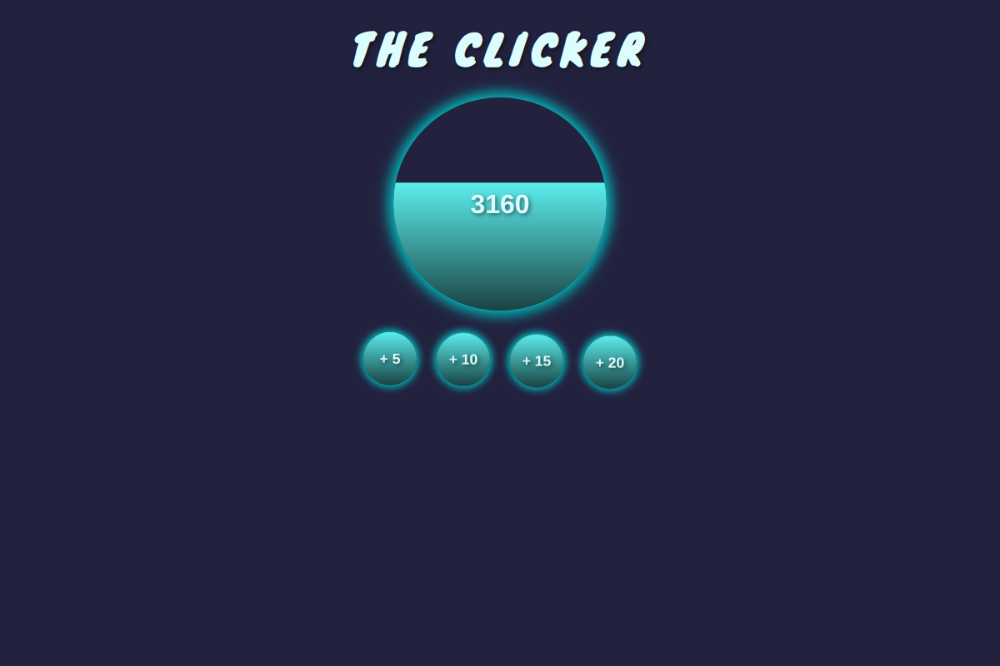

# The Clicker

## About

* A small project I built to practice the use of TypeScript in React.
* The majority of the app relies on type inference, but I also explored situations where explicit typing is needed — such as typing functional component props and working with styled-components prop interpolations.

## Features
* Responsive UI built with React and Styled Components.
* Clicking the main button increments the count.
* Extra buttons unlock every 100 clicks (up to 600).

## Tech Stack
* **Front End:** React, TypeScript, Styled-Components, HTML, CSS.
* **Build Tools:** Vite, Prettier.
* **Editor:** VS Code.

## Screenshot


## Prerequisites

Make sure you have the following installed:

* [Node.js](https://nodejs.org/en) (v18 or later)

## Installation
```bash
# Clone the repo
git clone https://github.com/AndrewAttemptsCode/the-clicker.git

# Navigate into the folder
cd the-clicker

# Install dependencies
npm install
```

## Running the app
```bash
# Start the development server
npm run dev
```